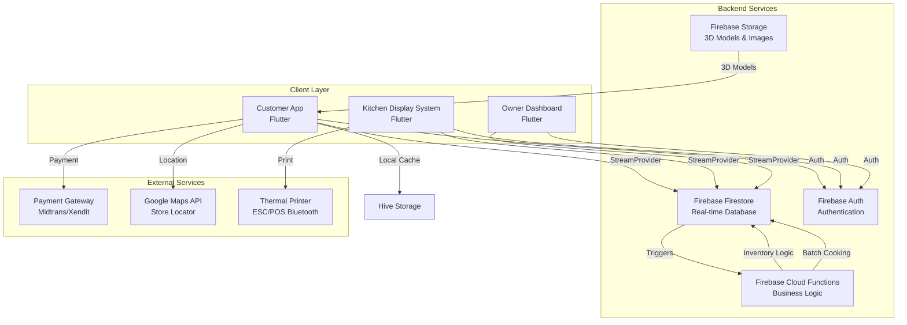
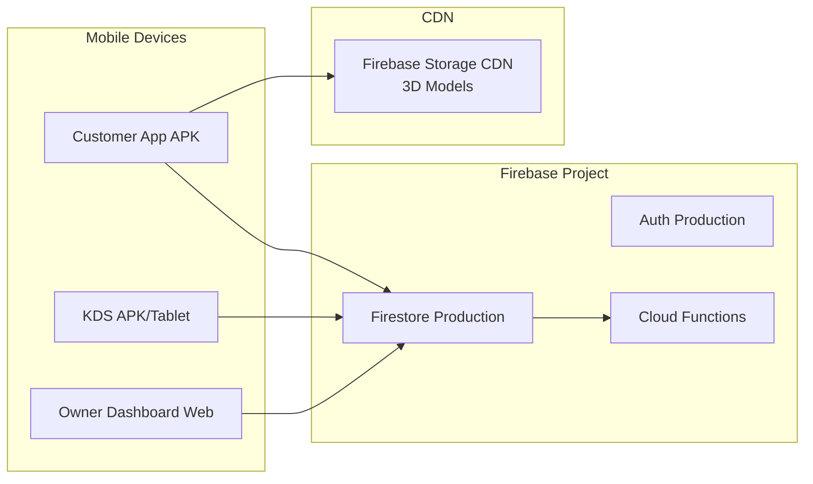

# Design Document: GepreKu Restaurant Ecosystem

## Overview

GepreKu adalah ekosistem restoran digital yang mengintegrasikan tiga aplikasi Flutter: Customer App dengan pengalaman 3D immersive, Kitchen Display System (KDS) untuk operasional dapur, dan Owner Dashboard untuk manajemen multi-outlet. Sistem ini dibangun dengan arsitektur real-time menggunakan Firebase Firestore sebagai backend, dengan fokus pada sinkronisasi data instan, offline capability, dan pengalaman pengguna yang engaging melalui elemen 3D interaktif.

### Key Design Goals

1. **Real-Time Synchronization**: Semua perubahan data (pesanan, inventori, service requests) harus tersinkronisasi dalam <2 detik
2. **3D Interactive Experience**: Memberikan pengalaman visual premium dengan 3D models yang dioptimasi untuk mobile
3. **Offline Resilience**: Customer App dapat beroperasi dalam mode offline dengan local caching
4. **Multi-Outlet Scalability**: Mendukung manajemen multiple outlets dengan inventori independen
5. **Performance**: Smooth 60fps animations pada device mid-range (Android 8.0+, 2GB RAM)

## Architecture

### System Architecture



### Technology Stack

**Frontend (All Apps)**
- **Framework**: Flutter 3.x (Dart)
- **State Management**: Riverpod 2.x dengan StreamProvider untuk real-time data
- **3D Rendering**: 
  - `model_viewer_plus` package untuk 3D model display (GLB/GLTF format)
  - `rive` package untuk 2D/3D character animations
- **Local Storage**: Hive untuk offline caching
- **UI Components**: Custom neumorphic design dengan Material 3

**Backend**
- **Database**: Firebase Firestore (NoSQL, real-time)
- **Authentication**: Firebase Auth dengan custom claims untuk RBAC
- **Storage**: Firebase Storage untuk 3D models dan images
- **Functions**: Firebase Cloud Functions (Node.js) untuk business logic

**External Integrations**
- **Payment**: Midtrans/Xendit SDK
- **Maps**: Google Maps Flutter plugin
- **Printer**: `esc_pos_bluetooth` package untuk thermal printing

### Deployment Architecture



## Components and Interfaces

### 1. Customer App Components

#### 1.1 3D Hero Carousel Component

**Purpose**: Menampilkan 5 best-selling menu items dalam carousel 3D interaktif

**Interface**:
```dart
class HeroCarousel3D extends ConsumerWidget {
  final List<Product> bestSellers;
  
  @override
  Widget build(BuildContext context, WidgetRef ref) {
    // Implementation
  }
}

class Product3DViewer extends StatefulWidget {
  final String modelUrl;
  final String fallbackImageUrl;
  final VoidCallback onTap;
  
  @override
  State<Product3DViewer> createState() => _Product3DViewerState();
}
```

**Dependencies**:
- `model_viewer_plus` untuk rendering 3D
- `carousel_slider` untuk carousel behavior
- Firestore `products` collection

**Data Flow**:
1. Query Firestore: `products.orderBy('sales_count', descending: true).limit(5)`
2. Preload adjacent models untuk smooth transitions
3. Fallback ke 2D image jika 3D model gagal load

#### 1.2 Spice Level Selector Component

**Purpose**: Interactive slider dengan 3D chili mascot yang berubah ekspresi

**Interface**:
```dart
class SpiceLevelSelector extends StatefulWidget {
  final Function(int level) onLevelChanged;
  final int initialLevel;
  
  @override
  State<SpiceLevelSelector> createState() => _SpiceLevelSelectorState();
}

class ChiliMascot3D extends StatelessWidget {
  final int spiceLevel; // 1-10
  final String riveAssetPath;
  
  @override
  Widget build(BuildContext context) {
    // Rive animation dengan 10 states
  }
}
```

**Rive Animation States**:
- Level 1-2: Happy, cool expression
- Level 3-4: Slightly warm
- Level 5-6: Sweating
- Level 7-8: Red face, steam
- Level 9-10: Fire breathing, extreme heat

#### 1.3 QR Scanner Component

**Purpose**: Scan QR code untuk table identification

**Interface**:
```dart
class QRScannerScreen extends ConsumerWidget {
  @override
  Widget build(BuildContext context, WidgetRef ref) {
    // mobile_scanner package
  }
}

class TableSession {
  final String tableId;
  final String outletId;
  final DateTime scannedAt;
  
  factory TableSession.fromQR(String qrData) {
    final json = jsonDecode(qrData);
    return TableSession(
      tableId: json['table_id'],
      outletId: json['outlet_id'],
      scannedAt: DateTime.now(),
    );
  }
}
```

**QR Code Format**:
```json
{
  "outlet_id": "outlet_abc123",
  "table_id": "table_05"
}
```

#### 1.4 Shared Cart Component

**Purpose**: Real-time collaborative cart untuk group orders

**Interface**:
```dart
class SharedCartProvider extends StreamNotifier<SharedCart> {
  @override
  Stream<SharedCart> build() {
    final cartId = ref.watch(sessionProvider).sharedCartId;
    return FirebaseFirestore.instance
      .collection('shared_carts')
      .doc(cartId)
      .snapshots()
      .map((doc) => SharedCart.fromFirestore(doc));
  }
  
  Future<void> addItem(CartItem item, String userId) async {
    // Optimistic update + Firestore write
  }
  
  Future<void> removeItem(String itemId) async {
    // Optimistic update + Firestore write
  }
}

class SharedCart {
  final String id;
  final Map<String, CartItem> items; // itemId -> CartItem
  final String ownerId;
  final List<String> participantIds;
  final DateTime createdAt;
}

class CartItem {
  final String productId;
  final String productName;
  final int quantity;
  final int? spiceLevel;
  final String addedBy; // userId
  final String addedByName;
}
```

**Real-Time Sync Strategy**:
- StreamProvider subscribes ke Firestore document
- Optimistic UI updates sebelum Firestore confirmation
- Conflict resolution: last-write-wins dengan timestamp

#### 1.5 Digital Bell Component

**Purpose**: Call waiter dengan kategori permintaan

**Interface**:
```dart
class DigitalBellButton extends ConsumerWidget {
  @override
  Widget build(BuildContext context, WidgetRef ref) {
    // Floating action button dengan cooldown
  }
}

class ServiceRequestDialog extends StatelessWidget {
  final List<String> categories = [
    'Tisu',
    'Alat Makan',
    'Air',
    'Bantuan Lain'
  ];
  
  @override
  Widget build(BuildContext context) {
    // Category selection dialog
  }
}

class ServiceRequest {
  final String tableId;
  final String outletId;
  final String category;
  final DateTime timestamp;
  final String status; // 'pending' | 'completed'
}
```

**Cooldown Mechanism**:
- Store last request timestamp di local state
- Disable button for 30 seconds after submission
- Visual countdown timer

#### 1.6 Payment Integration Component

**Purpose**: Process payments via Midtrans/Xendit

**Interface**:
```dart
class PaymentService {
  Future<PaymentResult> createTransaction({
    required String orderId,
    required double amount,
    required PaymentMethod method,
  }) async {
    // Call Payment Gateway API
  }
  
  Stream<PaymentStatus> listenToPaymentStatus(String transactionId) {
    // Listen to payment callbacks
  }
}

enum PaymentMethod {
  bankTransfer,
  eWallet,
  qris,
}

class PaymentResult {
  final String transactionId;
  final String paymentUrl;
  final String qrisImageUrl;
}
```

**Payment Flow**:
1. User selects payment method
2. Create transaction via Payment Gateway API
3. Display payment instructions (URL/QRIS)
4. Listen to webhook callbacks via Cloud Functions
5. Update order `payment_status` field
6. Proceed to order submission if paid

### 2. Kitchen Display System Components

#### 2.1 Order Stream Component

**Purpose**: Real-time display of pending orders

**Interface**:
```dart
class OrderStreamProvider extends StreamNotifier<List<Order>> {
  @override
  Stream<List<Order>> build() {
    final outletId = ref.watch(authProvider).outletId;
    return FirebaseFirestore.instance
      .collection('orders')
      .where('outlet_id', isEqualTo: outletId)
      .where('status', isEqualTo: 'Pending')
      .orderBy('created_at', descending: false)
      .snapshots()
      .map((snapshot) => snapshot.docs
          .map((doc) => Order.fromFirestore(doc))
          .toList());
  }
}

class OrderCard extends StatelessWidget {
  final Order order;
  final bool isOverdue; // > 10 minutes
  
  @override
  Widget build(BuildContext context) {
    // Display order with pulsating animation if overdue
  }
}
```

**Overdue Detection**:
```dart
bool isOrderOverdue(Order order) {
  final now = DateTime.now();
  final diff = now.difference(order.createdAt);
  return diff.inMinutes > 10;
}
```

#### 2.2 Batch Cooking Engine Component

**Purpose**: Group similar items across orders untuk batch cooking

**Interface**:
```dart
class BatchCookingEngine {
  List<BatchGroup> analyzeBatches(List<Order> pendingOrders) {
    final Map<String, BatchGroup> batches = {};
    
    for (final order in pendingOrders) {
      for (final item in order.items) {
        final key = item.productId;
        if (!batches.containsKey(key)) {
          batches[key] = BatchGroup(
            productId: key,
            productName: item.productName,
            totalQuantity: 0,
            orderIds: [],
          );
        }
        batches[key]!.totalQuantity += item.quantity;
        batches[key]!.orderIds.add(order.id);
      }
    }
    
    return batches.values.toList();
  }
}

class BatchGroup {
  final String productId;
  final String productName;
  int totalQuantity;
  final List<String> orderIds;
}
```

**Batch Display**:
```
┌─────────────────────────────────┐
│ 🍗 Ayam Geprek Crispy          │
│ Total: 12 portions              │
│ Across 5 orders: #001, #003... │
│ [Mark Batch Complete]           │
└─────────────────────────────────┘
```

#### 2.3 Thermal Printer Component

**Purpose**: Print orders ke ESC/POS thermal printer via Bluetooth

**Interface**:
```dart
class ThermalPrinterService {
  BluetoothDevice? connectedDevice;
  
  Future<List<BluetoothDevice>> discoverPrinters() async {
    // Bluetooth device discovery
  }
  
  Future<void> connectToPrinter(BluetoothDevice device) async {
    // Establish Bluetooth connection
  }
  
  Future<void> printOrder(Order order) async {
    final generator = Generator(PaperSize.mm58);
    List<int> bytes = [];
    
    bytes += generator.text('GEPREKU RESTAURANT',
        styles: PosStyles(align: PosAlign.center, bold: true));
    bytes += generator.text('Order #${order.id}');
    bytes += generator.text('Table: ${order.tableId}');
    bytes += generator.hr();
    
    for (final item in order.items) {
      bytes += generator.text(
        '${item.quantity}x ${item.productName}',
        styles: PosStyles(bold: true)
      );
      if (item.spiceLevel != null) {
        bytes += generator.text('  Spice Level: ${item.spiceLevel}');
      }
    }
    
    bytes += generator.hr();
    bytes += generator.text('Time: ${order.createdAt}');
    bytes += generator.cut();
    
    await connectedDevice?.write(bytes);
  }
}
```

**Print Queue**:
- Queue failed prints in Hive local storage
- Retry when printer reconnects
- Display queue status in KDS settings

### 3. Owner Dashboard Components

#### 3.1 Multi-Outlet Order Monitor

**Purpose**: Real-time monitoring of orders across all outlets

**Interface**:
```dart
class MultiOutletOrderProvider extends StreamNotifier<Map<String, List<Order>>> {
  @override
  Stream<Map<String, List<Order>>> build() {
    return FirebaseFirestore.instance
      .collection('orders')
      .snapshots()
      .map((snapshot) {
        final Map<String, List<Order>> grouped = {};
        for (final doc in snapshot.docs) {
          final order = Order.fromFirestore(doc);
          grouped.putIfAbsent(order.outletId, () => []).add(order);
        }
        return grouped;
      });
  }
}

class OutletOrderStats {
  final String outletId;
  final int totalOrders;
  final double totalRevenue;
  final double averageOrderValue;
  
  factory OutletOrderStats.calculate(List<Order> orders) {
    // Calculate statistics
  }
}
```

#### 3.2 Inventory Management Component

**Purpose**: Manage per-outlet inventory dengan bulk updates

**Interface**:
```dart
class InventoryProvider extends StreamNotifier<Map<String, List<ProductStock>>> {
  @override
  Stream<Map<String, List<ProductStock>>> build() {
    return FirebaseFirestore.instance
      .collection('products')
      .snapshots()
      .map((snapshot) {
        // Group by outlet_id
      });
  }
  
  Future<void> updateStock({
    required String outletId,
    required String productId,
    required int newQuantity,
  }) async {
    final userId = ref.read(authProvider).userId;
    
    await FirebaseFirestore.instance.runTransaction((transaction) async {
      final productRef = FirebaseFirestore.instance
        .collection('products')
        .doc(productId);
      
      transaction.update(productRef, {
        'stock_by_outlet.$outletId': newQuantity,
        'updated_at': FieldValue.serverTimestamp(),
      });
      
      // Log change
      final logRef = FirebaseFirestore.instance
        .collection('inventory_log')
        .doc();
      
      transaction.set(logRef, {
        'outlet_id': outletId,
        'product_id': productId,
        'quantity_change': newQuantity,
        'user_id': userId,
        'timestamp': FieldValue.serverTimestamp(),
      });
    });
  }
  
  Future<void> bulkUpdateFromCSV(String csvContent) async {
    // Parse CSV and batch update
  }
}

class ProductStock {
  final String productId;
  final String productName;
  final Map<String, int> stockByOutlet; // outletId -> quantity
}
```

**CSV Import Format**:
```csv
outlet_id,product_id,stock_quantity
outlet_abc123,prod_001,50
outlet_abc123,prod_002,30
outlet_xyz456,prod_001,40
```

## Data Models

### Firestore Collections Structure

#### Collection: `products`

```typescript
{
  id: string,
  name: string,
  description: string,
  category: string,
  price: number,
  model_3d_url: string | null,
  fallback_image_url: string,
  sales_count: number,
  is_spicy: boolean,
  stock_by_outlet: {
    [outlet_id: string]: number
  },
  created_at: Timestamp,
  updated_at: Timestamp
}
```

**Indexes**:
- `sales_count DESC` (for best sellers query)
- `category ASC, sales_count DESC` (for recommendations)
- `stock_by_outlet.[outlet_id] ASC` (for inventory queries)

#### Collection: `orders`

```typescript
{
  id: string,
  outlet_id: string,
  table_id: string | null,
  user_id: string,
  items: [
    {
      product_id: string,
      product_name: string,
      quantity: number,
      price: number,
      spice_level: number | null,
      added_by: string, // for shared carts
      added_by_name: string
    }
  ],
  total_amount: number,
  status: 'Pending' | 'Cooking' | 'Ready' | 'Completed' | 'Cancelled',
  payment_status: 'Unpaid' | 'Paid' | 'Failed',
  payment_transaction_id: string | null,
  created_at: Timestamp,
  updated_at: Timestamp
}
```

**Indexes**:
- `outlet_id ASC, status ASC, created_at ASC` (for KDS queries)
- `user_id ASC, created_at DESC` (for order history)
- `status ASC, created_at ASC` (for batch cooking)

#### Collection: `shared_carts`

```typescript
{
  id: string,
  outlet_id: string,
  table_id: string,
  owner_id: string,
  participant_ids: string[],
  items: {
    [item_id: string]: {
      product_id: string,
      product_name: string,
      quantity: number,
      price: number,
      spice_level: number | null,
      added_by: string,
      added_by_name: string,
      added_at: Timestamp
    }
  },
  created_at: Timestamp,
  updated_at: Timestamp
}
```

#### Collection: `service_requests`

```typescript
{
  id: string,
  outlet_id: string,
  table_id: string,
  category: 'Tisu' | 'Alat Makan' | 'Air' | 'Bantuan Lain',
  status: 'pending' | 'completed',
  created_at: Timestamp,
  completed_at: Timestamp | null
}
```

**Indexes**:
- `outlet_id ASC, status ASC, created_at DESC` (for KDS display)

#### Collection: `outlets`

```typescript
{
  id: string,
  name: string,
  address: string,
  location: GeoPoint,
  operating_hours: {
    [day: string]: {
      open: string, // "09:00"
      close: string // "22:00"
    }
  },
  status: 'Open' | 'Closed',
  created_at: Timestamp
}
```

#### Collection: `users`

```typescript
{
  id: string, // matches Firebase Auth UID
  name: string,
  email: string,
  phone: string | null,
  role: 'customer' | 'kitchen_staff' | 'owner',
  outlet_id: string | null, // for kitchen_staff
  created_at: Timestamp
}
```

#### Collection: `inventory_log`

```typescript
{
  id: string,
  outlet_id: string,
  product_id: string,
  quantity_change: number,
  reason: string,
  user_id: string,
  timestamp: Timestamp
}
```

### Firestore Security Rules

```javascript
rules_version = '2';
service cloud.firestore {
  match /databases/{database}/documents {
    
    // Helper functions
    function isAuthenticated() {
      return request.auth != null;
    }
    
    function getUserRole() {
      return get(/databases/$(database)/documents/users/$(request.auth.uid)).data.role;
    }
    
    function isCustomer() {
      return isAuthenticated() && getUserRole() == 'customer';
    }
    
    function isKitchenStaff() {
      return isAuthenticated() && getUserRole() == 'kitchen_staff';
    }
    
    function isOwner() {
      return isAuthenticated() && getUserRole() == 'owner';
    }
    
    // Products collection
    match /products/{productId} {
      allow read: if isAuthenticated();
      allow write: if isOwner();
    }
    
    // Orders collection
    match /orders/{orderId} {
      allow read: if isAuthenticated();
      allow create: if isCustomer() && request.auth.uid == request.resource.data.user_id;
      allow update: if isKitchenStaff() || isOwner();
    }
    
    // Shared carts collection
    match /shared_carts/{cartId} {
      allow read: if isAuthenticated();
      allow create: if isCustomer();
      allow update: if isCustomer() && 
        (request.auth.uid == resource.data.owner_id || 
         request.auth.uid in resource.data.participant_ids);
    }
    
    // Service requests collection
    match /service_requests/{requestId} {
      allow read: if isAuthenticated();
      allow create: if isCustomer();
      allow update: if isKitchenStaff() || isOwner();
    }
    
    // Outlets collection
    match /outlets/{outletId} {
      allow read: if isAuthenticated();
      allow write: if isOwner();
    }
    
    // Users collection
    match /users/{userId} {
      allow read: if isAuthenticated();
      allow create: if isAuthenticated() && request.auth.uid == userId;
      allow update: if isAuthenticated() && request.auth.uid == userId;
    }
    
    // Inventory log collection
    match /inventory_log/{logId} {
      allow read: if isOwner();
      allow create: if isOwner();
    }
  }
}
```

## Correctness Properties

*A property is a characteristic or behavior that should hold true across all valid executions of a system—essentially, a formal statement about what the system should do. Properties serve as the bridge between human-readable specifications and machine-verifiable correctness guarantees.*

Before writing properties, I need to analyze the acceptance criteria to determine which are testable as properties. Let me use the prework tool:


### Property Reflection

After analyzing all acceptance criteria, I've identified the following testable properties. Many criteria are integration tests (testing external services like Firestore, Google Maps, Payment Gateway) or timing/performance tests (animation timing, real-time sync latency). I'll focus on properties that test OUR code's logic with meaningful input variation.

**Redundancy Analysis:**
- Properties 1.1 and 1.6 both test best seller selection - can be combined into one property about sorting and limiting
- Properties 3.3 and 3.4 both test session/order data storage - can be combined into one round-trip property
- Properties 4.6 and 4.5 both test cart-to-order conversion - can be combined
- Properties 10.1 and 10.5 both test inventory tracking - can be combined into one property about stock changes
- Properties 13.1 and 13.2 both test outlet-specific inventory - can be combined
- Properties 17.1 and 17.2 both test optimistic UI - can be combined into one property

**Properties to Include:**
1. Best seller carousel selection (combines 1.1, 1.6)
2. 3D model fallback behavior (1.5)
3. Spice level storage round-trip (2.3, 2.5)
4. QR code parsing (3.1, 3.6)
5. QR code validation (3.5)
6. Session data round-trip (3.3, 3.4)
7. Shared cart ID uniqueness (4.1)
8. Cart ownership authorization (4.7)
9. Shared cart to order conversion (4.6, 4.5)
10. Recommendation count limit (5.2)
11. Recommendation filtering (5.3)
12. Service request document structure (6.3)
13. Digital bell cooldown (6.6)
14. Welcome message personalization (7.1)
15. Quick reorder frequency calculation (7.3, 7.5)
16. Quick reorder customization preservation (7.4)
17. Order overdue detection (8.3)
18. Order sorting (8.6)
19. Batch grouping (9.1, 9.2)
20. Batch completion updates (9.3)
21. Inventory decrement (10.1, 10.5)
22. Sold out detection (10.2)
23. Low stock warning (10.4)
24. Print format completeness (11.2)
25. Print queue and retry (11.4)
26. Outlet detail display (12.4)
27. Distance calculation (12.5)
28. Outlet filtering (12.6)
29. Outlet selection storage (12.7)
30. Inventory grouping by outlet (13.1, 13.2)
31. CSV import parsing (13.3)
32. Payment success order creation (14.4)
33. Payment failure handling (14.5)
34. Transaction ID storage (14.6)
35. Role-based access control (15.3, 15.4, 15.5)
36. Offline data loading (16.1)
37. Data caching (16.2)
38. Offline cart storage (16.3)
39. Offline submission prevention (16.6)
40. Optimistic UI updates (17.1, 17.2)
41. Optimistic UI rollback (17.3)
42. Error logging (17.5)
43. Skeleton layout matching (18.5)
44. Order statistics calculation (20.4)
45. Order filtering (20.5)

### Property 1: Best Seller Carousel Selection

*For any* list of products with varying sales_count values, the carousel SHALL display exactly 5 products with the highest sales_count values in descending order.

**Validates: Requirements 1.1, 1.6**

### Property 2: 3D Model Fallback

*For any* product with an invalid or unreachable model_3d_url, the Customer_App SHALL display the fallback_image_url instead.

**Validates: Requirements 1.5**

### Property 3: Spice Level Round-Trip

*For any* spice level value between 1 and 10, when stored in order item metadata and retrieved, the value SHALL be preserved exactly.

**Validates: Requirements 2.3, 2.5**

### Property 4: QR Code Parsing

*For any* valid JSON QR code containing outlet_id and table_id fields, the QR_Scanner SHALL correctly extract both values.

**Validates: Requirements 3.1, 3.6**

### Property 5: QR Code Validation

*For any* malformed or invalid QR code payload, the Customer_App SHALL display the error message "QR Code tidak valid".

**Validates: Requirements 3.5**

### Property 6: Session Data Round-Trip

*For any* table_id and outlet_id pair, when stored in the session and used to create an order, both values SHALL appear in the order document.

**Validates: Requirements 3.3, 3.4**

### Property 7: Shared Cart ID Uniqueness

*For any* set of group orders created concurrently, all generated shared_cart_id values SHALL be unique.

**Validates: Requirements 4.1**

### Property 8: Cart Ownership Authorization

*For any* shared cart, only the user with user_id matching the cart's owner_id SHALL be able to submit the final order.

**Validates: Requirements 4.7**

### Property 9: Shared Cart to Order Conversion

*For any* shared cart with multiple items added by different users, the converted order document SHALL contain all items with their respective addedBy usernames.

**Validates: Requirements 4.5, 4.6**

### Property 10: Recommendation Count Limit

*For any* recommendation query result, the Customer_App SHALL display at most 3 products.

**Validates: Requirements 5.2**

### Property 11: Recommendation Filtering

*For any* product list, all recommended products SHALL have sales_count values above the median sales_count of the entire product list.

**Validates: Requirements 5.3**

### Property 12: Service Request Document Structure

*For any* service request created via Digital_Bell, the Firestore document SHALL contain table_id, outlet_id, category, and timestamp fields.

**Validates: Requirements 6.3**

### Property 13: Digital Bell Cooldown

*For any* service request submission, the Digital_Bell button SHALL remain disabled for exactly 30 seconds.

**Validates: Requirements 6.6**

### Property 14: Welcome Message Personalization

*For any* returning user with username, the Customer_App SHALL display "Welcome Back [username]" where [username] is replaced with the actual username.

**Validates: Requirements 7.1**

### Property 15: Quick Reorder Frequency Calculation

*For any* user's order history, the 3 most frequently ordered items SHALL be those with the highest occurrence count across all orders.

**Validates: Requirements 7.3, 7.5**

### Property 16: Quick Reorder Customization Preservation

*For any* previously ordered item with customizations (e.g., spice_level), when reordered via Quick Reorder, all customizations SHALL be preserved in the new cart item.

**Validates: Requirements 7.4**

### Property 17: Order Overdue Detection

*For any* order with created_at timestamp more than 10 minutes in the past, the KDS SHALL apply a pulsating red border animation to the order card.

**Validates: Requirements 8.3**

### Property 18: Order Sorting

*For any* list of pending orders, the KDS SHALL display them sorted by created_at timestamp in ascending order (oldest first).

**Validates: Requirements 8.6**

### Property 19: Batch Grouping

*For any* set of pending orders, items with the same product_id SHALL be grouped together with accurate total quantity and order ID list.

**Validates: Requirements 9.1, 9.2**

### Property 20: Batch Completion Updates

*For any* batch group marked as completed, all orders containing that product_id SHALL have their status updated to "Cooking".

**Validates: Requirements 9.3**

### Property 21: Inventory Decrement and Logging

*For any* order that changes status to "Cooking", the stock_quantity for each item SHALL decrement by the ordered quantity, and an inventory_log entry SHALL be created with timestamp, product_id, quantity_change, and reason.

**Validates: Requirements 10.1, 10.5**

### Property 22: Sold Out Detection

*For any* product with stock_quantity equal to zero, the Customer_App SHALL mark the product as "Sold Out" and prevent new orders.

**Validates: Requirements 10.2**

### Property 23: Low Stock Warning

*For any* product with stock_quantity less than 10, the Owner_Dashboard SHALL display a low-stock warning.

**Validates: Requirements 10.4**

### Property 24: Print Format Completeness

*For any* order sent to the thermal printer, the formatted output SHALL contain order_id, table_id, all items with quantities, and any special instructions (e.g., spice_level).

**Validates: Requirements 11.2**

### Property 25: Print Queue and Retry

*For any* print job attempted while the printer is offline, the job SHALL be queued and automatically retried when the printer connection is restored.

**Validates: Requirements 11.4**

### Property 26: Outlet Detail Display

*For any* outlet marker tapped on the map, the displayed details SHALL include name, address, operating_hours, and calculated distance from user.

**Validates: Requirements 12.4**

### Property 27: Distance Calculation

*For any* outlet Geopoint and user location Geopoint, the calculated distance SHALL be accurate within standard geospatial calculation tolerances.

**Validates: Requirements 12.5**

### Property 28: Outlet Filtering

*For any* outlet list filtered by status "Open" or "Closed", all displayed outlets SHALL match the selected status value.

**Validates: Requirements 12.6**

### Property 29: Outlet Selection Storage

*For any* outlet selected by the user, the outlet_id SHALL be stored in the current session and persist for subsequent operations.

**Validates: Requirements 12.7**

### Property 30: Inventory Grouping by Outlet

*For any* inventory update to a specific outlet, only that outlet's stock_quantity SHALL be modified, leaving other outlets' stock unchanged.

**Validates: Requirements 13.1, 13.2**

### Property 31: CSV Import Parsing

*For any* valid CSV file with columns outlet_id, product_id, stock_quantity, all rows SHALL be parsed and applied as stock updates to the correct outlet-product combinations.

**Validates: Requirements 13.3**

### Property 32: Payment Success Order Creation

*For any* successful payment transaction, an order document SHALL be created with status "Pending" and payment_status "Paid".

**Validates: Requirements 14.4**

### Property 33: Payment Failure Handling

*For any* failed payment transaction, the Customer_App SHALL display an error message and provide a retry option without creating an order.

**Validates: Requirements 14.5**

### Property 34: Transaction ID Storage

*For any* payment transaction, the transaction_id SHALL be stored in the order document for reconciliation purposes.

**Validates: Requirements 14.6**

### Property 35: Role-Based Access Control

*For any* user with role "customer", access SHALL be granted to Customer_App and denied to KDS and Owner_Dashboard. *For any* user with role "kitchen_staff", access SHALL be granted to KDS and denied to Customer_App and Owner_Dashboard. *For any* user with role "owner", access SHALL be granted to Owner_Dashboard and KDS, and denied to Customer_App.

**Validates: Requirements 15.3, 15.4, 15.5**

### Property 36: Offline Data Loading

*For any* product data previously cached in Hive, when the Customer_App detects no internet connection, the cached data SHALL be loaded and displayed.

**Validates: Requirements 16.1**

### Property 37: Data Caching

*For any* product data fetched from Firestore, the data SHALL be written to Hive cache for offline access.

**Validates: Requirements 16.2**

### Property 38: Offline Cart Storage

*For any* cart item added while offline, the item SHALL be stored in Hive local storage.

**Validates: Requirements 16.3**

### Property 39: Offline Submission Prevention

*For any* order submission attempt while offline, the submission SHALL be blocked and the message "Pesanan akan dikirim saat koneksi tersedia" SHALL be displayed.

**Validates: Requirements 16.6**

### Property 40: Optimistic UI Updates

*For any* cart operation (add or remove item), the UI SHALL update immediately before Firestore write completion.

**Validates: Requirements 17.1, 17.2**

### Property 41: Optimistic UI Rollback

*For any* optimistic UI update where the Firestore write fails, the UI SHALL revert to the previous state and display an error message.

**Validates: Requirements 17.3**

### Property 42: Error Logging

*For any* failed optimistic operation, an error document SHALL be created in the error_log collection.

**Validates: Requirements 17.5**

### Property 43: Skeleton Layout Matching

*For any* Skeleton_Loader placeholder, the layout dimensions SHALL match the dimensions of the actual content to prevent layout shift.

**Validates: Requirements 18.5**

### Property 44: Order Statistics Calculation

*For any* set of orders for an outlet, the calculated statistics (total orders, total revenue, average order value) SHALL be mathematically accurate.

**Validates: Requirements 20.4**

### Property 45: Order Filtering

*For any* order list filtered by outlet_id, status, or date range, all displayed orders SHALL match all applied filter criteria.

**Validates: Requirements 20.5**

## Error Handling

### Error Categories and Strategies

#### 1. Network Errors

**Scenarios:**
- Firestore connection lost during operation
- Payment gateway API timeout
- Google Maps API failure
- Firebase Storage unreachable

**Handling Strategy:**
```dart
class NetworkErrorHandler {
  Future<T> withRetry<T>({
    required Future<T> Function() operation,
    int maxRetries = 3,
    Duration retryDelay = const Duration(seconds: 2),
  }) async {
    int attempts = 0;
    while (attempts < maxRetries) {
      try {
        return await operation();
      } on FirebaseException catch (e) {
        attempts++;
        if (attempts >= maxRetries) {
          throw NetworkException('Operation failed after $maxRetries attempts: ${e.message}');
        }
        await Future.delayed(retryDelay * attempts); // Exponential backoff
      }
    }
    throw NetworkException('Unexpected error in retry logic');
  }
}
```

**User Experience:**
- Display toast notification: "Koneksi terputus, mencoba kembali..."
- Show retry button for manual retry
- Queue operations for later sync (cart updates, service requests)

#### 2. Data Validation Errors

**Scenarios:**
- Invalid QR code format
- Empty cart submission
- Invalid spice level (outside 1-10 range)
- Malformed CSV import data

**Handling Strategy:**
```dart
class ValidationException implements Exception {
  final String message;
  final String field;
  
  ValidationException(this.message, this.field);
}

class OrderValidator {
  void validateOrder(Order order) {
    if (order.items.isEmpty) {
      throw ValidationException('Cart cannot be empty', 'items');
    }
    
    for (final item in order.items) {
      if (item.spiceLevel != null && (item.spiceLevel! < 1 || item.spiceLevel! > 10)) {
        throw ValidationException('Spice level must be between 1 and 10', 'spice_level');
      }
    }
    
    if (order.totalAmount <= 0) {
      throw ValidationException('Order total must be positive', 'total_amount');
    }
  }
}
```

**User Experience:**
- Display inline error messages near invalid fields
- Prevent form submission until validation passes
- Highlight invalid fields in red

#### 3. Authentication and Authorization Errors

**Scenarios:**
- User not authenticated
- Insufficient permissions (wrong role)
- Session expired
- Firestore security rules violation

**Handling Strategy:**
```dart
class AuthErrorHandler {
  void handleAuthError(FirebaseAuthException e) {
    switch (e.code) {
      case 'user-not-found':
      case 'wrong-password':
        throw AuthException('Email atau password salah');
      case 'user-disabled':
        throw AuthException('Akun Anda telah dinonaktifkan');
      case 'too-many-requests':
        throw AuthException('Terlalu banyak percobaan login. Coba lagi nanti.');
      case 'permission-denied':
        throw AuthException('Anda tidak memiliki akses ke fitur ini');
      default:
        throw AuthException('Terjadi kesalahan autentikasi');
    }
  }
}
```

**User Experience:**
- Redirect to login screen if session expired
- Display role-specific error: "Fitur ini hanya untuk pemilik restoran"
- Provide "Contact Support" button for persistent issues

#### 4. Resource Loading Errors

**Scenarios:**
- 3D model failed to load
- Image loading timeout
- Rive animation file corrupted
- Firebase Storage quota exceeded

**Handling Strategy:**
```dart
class ResourceLoader {
  Future<Widget> load3DModel(String url, String fallbackImageUrl) async {
    try {
      return Model3DViewer(url: url);
    } catch (e) {
      logger.error('3D model load failed: $url', error: e);
      return Image.network(
        fallbackImageUrl,
        errorBuilder: (context, error, stackTrace) {
          return PlaceholderImage();
        },
      );
    }
  }
}
```

**User Experience:**
- Graceful degradation to 2D images
- Display placeholder with "Gagal memuat" message
- Continue app functionality without blocking

#### 5. Payment Errors

**Scenarios:**
- Payment gateway timeout
- Insufficient balance
- Payment declined by bank
- Webhook callback failure

**Handling Strategy:**
```dart
class PaymentErrorHandler {
  String getErrorMessage(String errorCode) {
    switch (errorCode) {
      case 'insufficient_balance':
        return 'Saldo tidak mencukupi';
      case 'card_declined':
        return 'Pembayaran ditolak oleh bank';
      case 'expired_card':
        return 'Kartu sudah kadaluarsa';
      case 'gateway_timeout':
        return 'Koneksi ke payment gateway terputus. Silakan coba lagi.';
      default:
        return 'Pembayaran gagal. Silakan coba metode pembayaran lain.';
    }
  }
  
  Future<void> handlePaymentFailure(Order order, String errorCode) async {
    // Log to analytics
    await FirebaseFirestore.instance.collection('payment_failures').add({
      'order_id': order.id,
      'error_code': errorCode,
      'timestamp': FieldValue.serverTimestamp(),
    });
    
    // Keep order in draft state
    await FirebaseFirestore.instance.collection('draft_orders').doc(order.id).set(order.toJson());
  }
}
```

**User Experience:**
- Display clear error message with suggested actions
- Offer alternative payment methods
- Save order as draft for retry
- Provide customer support contact

#### 6. Inventory Errors

**Scenarios:**
- Product sold out during checkout
- Stock quantity mismatch (race condition)
- Negative stock after decrement

**Handling Strategy:**
```dart
class InventoryManager {
  Future<void> decrementStock(String productId, int quantity) async {
    await FirebaseFirestore.instance.runTransaction((transaction) async {
      final productRef = FirebaseFirestore.instance.collection('products').doc(productId);
      final productDoc = await transaction.get(productRef);
      
      if (!productDoc.exists) {
        throw InventoryException('Product not found');
      }
      
      final currentStock = productDoc.data()!['stock_quantity'] as int;
      
      if (currentStock < quantity) {
        throw InventoryException('Insufficient stock. Available: $currentStock, Requested: $quantity');
      }
      
      transaction.update(productRef, {
        'stock_quantity': currentStock - quantity,
      });
    });
  }
}
```

**User Experience:**
- Display "Stok habis" badge on sold-out products
- Remove sold-out items from cart automatically
- Suggest alternative products
- Notify user: "Maaf, [Product Name] sudah habis. Silakan pilih produk lain."

#### 7. Printer Errors

**Scenarios:**
- Bluetooth printer disconnected
- Printer out of paper
- Print command failed
- Unsupported printer model

**Handling Strategy:**
```dart
class PrinterErrorHandler {
  final Queue<PrintJob> printQueue = Queue();
  
  Future<void> handlePrintError(PrintJob job, Exception error) async {
    logger.error('Print failed', error: error);
    
    // Queue for retry
    printQueue.add(job);
    
    // Save to local storage
    await Hive.box('print_queue').add(job.toJson());
    
    // Notify user
    showNotification('Print gagal. Job disimpan untuk retry otomatis.');
  }
  
  Future<void> retryQueuedJobs() async {
    while (printQueue.isNotEmpty) {
      final job = printQueue.first;
      try {
        await printOrder(job.order);
        printQueue.removeFirst();
        await Hive.box('print_queue').delete(job.id);
      } catch (e) {
        // Stop retrying if still failing
        break;
      }
    }
  }
}
```

**User Experience:**
- Display printer status indicator in KDS
- Show queued print jobs count
- Manual retry button for failed prints
- Alert: "Printer terputus. 3 pesanan menunggu untuk dicetak."

### Global Error Boundary

```dart
class GlobalErrorHandler {
  static void initialize() {
    FlutterError.onError = (FlutterErrorDetails details) {
      logger.error('Flutter error', error: details.exception, stackTrace: details.stack);
      
      // Log to Firestore for monitoring
      FirebaseFirestore.instance.collection('error_log').add({
        'error': details.exception.toString(),
        'stack_trace': details.stack.toString(),
        'timestamp': FieldValue.serverTimestamp(),
        'app_version': AppConfig.version,
      });
    };
    
    PlatformDispatcher.instance.onError = (error, stack) {
      logger.error('Platform error', error: error, stackTrace: stack);
      return true;
    };
  }
}
```

## Testing Strategy

### Testing Approach

GepreKu requires a comprehensive testing strategy that combines unit tests, property-based tests, integration tests, and manual testing. Given the nature of the system (3D UI, real-time sync, hardware integration), we'll use a balanced approach.

### 1. Property-Based Testing

**Applicable Areas:**
- Data transformation logic (QR parsing, cart conversion, batch grouping)
- Business logic (inventory decrement, statistics calculation, filtering)
- Validation logic (input validation, access control)

**Library:** `dart_check` (Dart's property-based testing library)

**Configuration:**
- Minimum 100 iterations per property test
- Each test tagged with: `Feature: gepreku-restaurant-ecosystem, Property {number}: {property_text}`

**Example Property Test:**
```dart
import 'package:dart_check/dart_check.dart';
import 'package:test/test.dart';

// Feature: gepreku-restaurant-ecosystem, Property 4: QR Code Parsing
void main() {
  group('QR Code Parsing Properties', () {
    test('For any valid JSON QR code, parsing extracts outlet_id and table_id', () {
      forAll(
        tuple2(arbitrary.string, arbitrary.string),
        (tuple) {
          final outletId = tuple.item1;
          final tableId = tuple.item2;
          
          final qrJson = jsonEncode({
            'outlet_id': outletId,
            'table_id': tableId,
          });
          
          final session = TableSession.fromQR(qrJson);
          
          expect(session.outletId, equals(outletId));
          expect(session.tableId, equals(tableId));
        },
        maxExamples: 100,
      );
    });
  });
}
```

**Property Test Coverage:**
- All 45 correctness properties defined above
- Focus on pure functions and business logic
- Mock external dependencies (Firestore, Payment Gateway)

### 2. Unit Testing

**Applicable Areas:**
- Widget rendering (specific examples)
- Component behavior (button states, form validation)
- Utility functions (date formatting, distance calculation)
- Error handling paths

**Library:** `flutter_test`

**Example Unit Test:**
```dart
import 'package:flutter_test/flutter_test.dart';

void main() {
  group('Digital Bell Cooldown', () {
    test('Button is disabled for 30 seconds after submission', () async {
      final controller = DigitalBellController();
      
      // Submit request
      await controller.submitRequest('Tisu');
      
      // Verify button is disabled
      expect(controller.isButtonEnabled, isFalse);
      
      // Wait 30 seconds
      await Future.delayed(Duration(seconds: 30));
      
      // Verify button is enabled again
      expect(controller.isButtonEnabled, isTrue);
    });
  });
}
```

### 3. Integration Testing

**Applicable Areas:**
- Firestore real-time sync
- Firebase Auth flow
- Payment gateway integration
- Google Maps integration
- Bluetooth printer communication

**Library:** `integration_test` package

**Test Environment:**
- Firebase Emulator Suite for Firestore and Auth
- Mock payment gateway (test mode)
- Mock Bluetooth devices

**Example Integration Test:**
```dart
import 'package:integration_test/integration_test.dart';
import 'package:flutter_test/flutter_test.dart';

void main() {
  IntegrationTestWidgetsFlutterBinding.ensureInitialized();
  
  group('Order Real-Time Sync', () {
    testWidgets('KDS displays new order within 2 seconds', (tester) async {
      // Setup: Launch KDS app
      await tester.pumpWidget(MyApp());
      await tester.pumpAndSettle();
      
      // Create order in Firestore
      final startTime = DateTime.now();
      await FirebaseFirestore.instance.collection('orders').add({
        'outlet_id': 'test_outlet',
        'status': 'Pending',
        'items': [/* ... */],
        'created_at': FieldValue.serverTimestamp(),
      });
      
      // Wait for order to appear in KDS
      await tester.pump(Duration(seconds: 2));
      
      // Verify order is displayed
      expect(find.text('Order #'), findsOneWidget);
      
      final endTime = DateTime.now();
      final latency = endTime.difference(startTime);
      expect(latency.inSeconds, lessThanOrEqualTo(2));
    });
  });
}
```

### 4. Widget Testing

**Applicable Areas:**
- UI component rendering
- User interactions (taps, swipes, drags)
- Navigation flows
- Form submissions

**Example Widget Test:**
```dart
import 'package:flutter_test/flutter_test.dart';

void main() {
  group('Spice Level Selector', () {
    testWidgets('Displays slider with range 1-10 for spicy items', (tester) async {
      final product = Product(name: 'Ayam Geprek', isSpicy: true);
      
      await tester.pumpWidget(
        MaterialApp(
          home: Scaffold(
            body: SpiceLevelSelector(product: product),
          ),
        ),
      );
      
      // Verify slider exists
      expect(find.byType(Slider), findsOneWidget);
      
      // Verify range
      final slider = tester.widget<Slider>(find.byType(Slider));
      expect(slider.min, equals(1.0));
      expect(slider.max, equals(10.0));
    });
  });
}
```

### 5. Manual Testing

**Applicable Areas:**
- 3D model rendering and interactions
- Animation smoothness and timing
- Neumorphic UI aesthetics
- Thermal printer physical output
- Performance on target devices

**Test Devices:**
- Android 8.0, 2GB RAM (minimum spec)
- Android 12, 4GB RAM (mid-range)
- Android 14, 8GB RAM (high-end)
- Tablet for KDS (10" screen)

**Manual Test Checklist:**
- [ ] 3D carousel swipe smoothness (60fps)
- [ ] 3D model rotation gesture responsiveness
- [ ] Chili mascot expression changes (all 10 levels)
- [ ] Neumorphic button press animations
- [ ] Skeleton loader shimmer effect
- [ ] Thermal printer output quality
- [ ] QR code scanning accuracy
- [ ] Offline mode functionality
- [ ] Real-time sync across devices
- [ ] Payment flow end-to-end

### 6. Performance Testing

**Metrics:**
- App startup time: < 3 seconds
- 3D model load time: < 2 seconds
- Firestore query response: < 500ms
- Animation frame rate: 60fps
- Memory usage: < 200MB on mid-range devices

**Tools:**
- Flutter DevTools for profiling
- Firebase Performance Monitoring
- Custom performance logging

### Test Coverage Goals

- **Unit Tests**: 80% code coverage for business logic
- **Property Tests**: 100% coverage of all 45 correctness properties
- **Integration Tests**: All external service integrations
- **Widget Tests**: All critical user flows
- **Manual Tests**: All UI/UX features

### Continuous Integration

**CI Pipeline:**
1. Run unit tests and property tests
2. Run widget tests
3. Run integration tests (with Firebase Emulator)
4. Generate coverage report
5. Build APK for manual testing
6. Deploy to Firebase App Distribution for QA

**Tools:**
- GitHub Actions or GitLab CI
- Firebase Test Lab for device testing
- Codecov for coverage tracking

